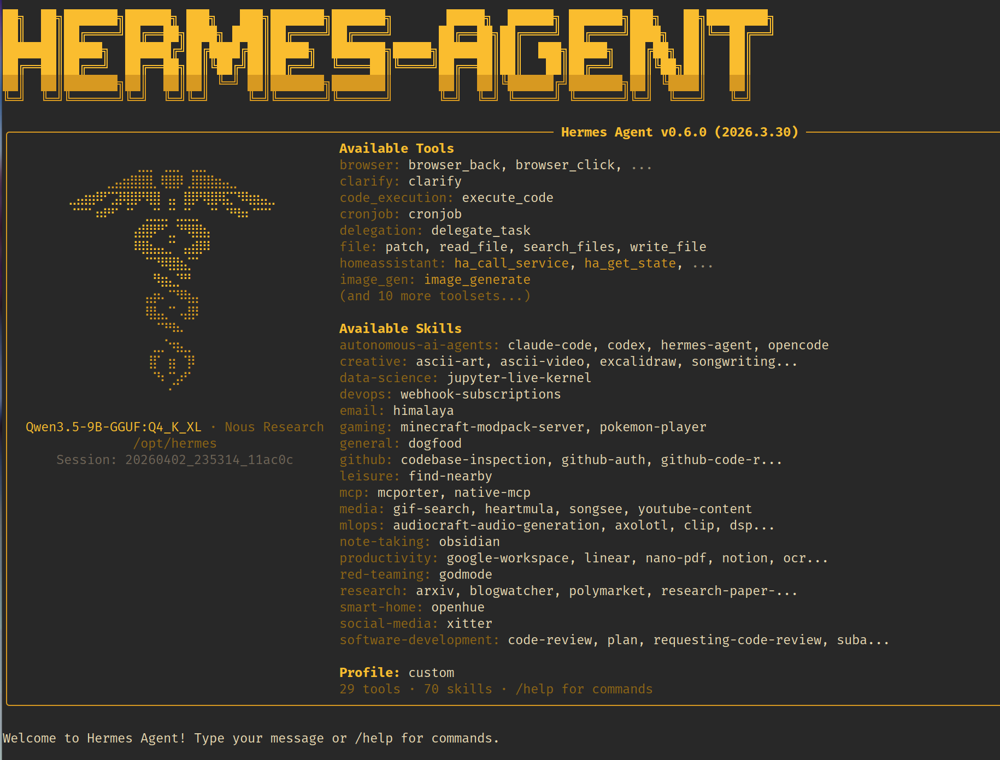

# Run Hermes Agent with Harbor and Local LLMs

Harbor can run Hermes Agent with local LLMs as part of a Docker Compose local AI stack. Use this guide when you want a Hermes Agent Harbor setup, a local AI agent backed by Ollama or llama.cpp, or a self-hosted agent workflow that can use Harbor's OpenAI-compatible local backends.

[Hermes Agent](./2.3.76-Satellite-Hermes-Agent.md) is an autonomous AI agent from Nous Research. In Harbor, Hermes can be used in two user-selectable ways:

- Run an installed host `hermes` CLI through [`harbor launch`](./3.-Harbor-CLI-Reference.md#harbor-launch-launch-options---service-servicetool-args), with Harbor supplying the backend URL, API key, and model.
- Run the containerized Hermes Agent service with `harbor up hermes`, then use `harbor hermes ...` or the service's OpenAI-compatible API server.

Both paths are useful. Choose the one that matches how you want to run Hermes.

## Hermes Agent Harbor Stack


*Hermes Agent running through Harbor.*

A practical Hermes Agent Harbor stack usually has these pieces:

- A local LLM backend such as [Ollama](./2.2.1-Backend&colon-Ollama.md), [llama.cpp](./2.2.2-Backend&colon-llama.cpp.md), or another OpenAI-compatible backend.
- Hermes Agent as a host CLI launched by Harbor, or as the `hermes` Harbor service.
- Optional web search through Harbor Boost and SearXNG when using `harbor launch --web`.
- Optional service integrations such as Unsloth Studio, Traefik, and Harbor CLI mounts when those handles are selected.

Harbor keeps the wiring in Docker Compose files and launch adapters. That is the difference between a manual Hermes Agent Docker Compose setup and a Harbor local AI toolkit workflow: you use service handles and launch options instead of hand-editing provider URLs for each run.

## Run Hermes Agent with Local LLMs from the Host

Use `harbor launch` when you already have the host `hermes` CLI installed and want Harbor to point it at a selected backend:

```bash
harbor launch --backend ollama --model qwen3.5:4b hermes
```

For Hermes, Harbor sets:

- `OPENAI_BASE_URL` to the selected Harbor backend's `/v1` endpoint.
- `OPENAI_API_KEY` to the key expected by that backend path.
- `HERMES_MODEL` to the selected model.

If you do not pass Hermes arguments, Harbor launches Hermes with `chat`. Arguments after `hermes` are passed through to the host tool:

```bash
harbor launch --backend ollama --model qwen3.5:4b hermes chat
```

Print the launch environment without starting Hermes:

```bash
harbor launch --config --backend ollama --model qwen3.5:4b hermes
```

This path is useful for searches like `run Hermes Agent with local LLMs`, `Hermes Agent Ollama`, and `local AI agent with OpenAI-compatible backend`.

## Add Web Search to Hermes Launch

Hermes is one of Harbor's OpenAI-compatible host launch targets, so it can use the same `--web` path as other compatible host tools:

```bash
harbor launch --web --backend ollama --model qwen3.5:4b hermes
```

`--web` starts SearXNG and Harbor Boost web tools, then routes Hermes to a generated Boost workflow model with `web_search` and `read_url` available. Use this when the agent should search documentation, read URLs, or gather current context while still using a Harbor-managed local backend.

For the broader host-tool pattern, read [Run Coding Agents with Local LLMs](./8.3-Run-Coding-Agents-with-Local-LLMs.md).

## Run the Hermes Agent Service

Use the Harbor service path when you want the containerized Hermes Agent service:

```bash
harbor up hermes
```

Hermes has no web UI in Harbor. It is a CLI agent with an OpenAI-compatible API server. Harbor exposes the API at:

```text
http://localhost:34801/v1
```

The API is gated by an API key, defaulting to `sk-hermes`. Pass it as the bearer token, and change it with `harbor hermes api_key <key>`.

Run Hermes CLI commands through the container:

```bash
harbor hermes chat
harbor hermes version
harbor hermes api_key
```

The service stores Hermes data under `HARBOR_HERMES_WORKSPACE`, mounted into the container at `/opt/data`. Configure the API server port, image, version, workspace, and API key through Harbor config; configure provider keys or gateway tokens through `harbor env hermes`.

See the [Hermes Agent service docs](./2.3.76-Satellite-Hermes-Agent.md) for the full config surface.

## Hermes Agent Ollama Setup

For a Hermes Agent Ollama stack, run Hermes with Ollama selected:

```bash
harbor up hermes ollama
```

The Hermes/Ollama cross-service Compose file points `OPENAI_BASE_URL` at Harbor's internal Ollama `/v1` endpoint. This gives the Hermes service an OpenAI-compatible local backend without manually editing the Hermes container environment.

For the host CLI version of the same idea, use:

```bash
harbor launch --backend ollama --model qwen3.5:4b hermes
```

This is the simplest Harbor path for a local Hermes Agent setup backed by Ollama.

## Hermes Agent with llama.cpp and Other Backends

Use llama.cpp when your model workflow is GGUF-focused or when you want to test Hermes against a llama.cpp OpenAI-compatible server:

```bash
harbor up hermes llamacpp
```

The Hermes/llama.cpp cross-service Compose file points `OPENAI_BASE_URL` at `http://llamacpp:8080/v1` inside the Harbor network.

The host launch equivalent is:

```bash
harbor launch --backend llamacpp --model Qwen3.5-4B hermes
```

Harbor Launch also works with other compatible backends listed in [OpenAI-Compatible Local LLM Backends](./8.5-OpenAI-Compatible-Local-LLM-Backends.md), as long as the selected backend exposes a reachable OpenAI-style endpoint and model list or you pass `--model` explicitly.

## Hermes Agent Docker Compose Integrations

Harbor's Hermes service is still a Docker Compose service. The main service file exposes the Hermes API server on port `8642` inside the container and maps it to `HARBOR_HERMES_HOST_PORT` on the host.

Selected service combinations add integration files:

- `hermes + ollama` sets `OPENAI_BASE_URL` to the internal Ollama `/v1` endpoint.
- `hermes + llamacpp` sets `OPENAI_BASE_URL` to the internal llama.cpp `/v1` endpoint.
- `hermes + unsloth-studio` points Hermes at Unsloth Studio and reads the generated API key at runtime.
- `hermes + traefik` exposes the Hermes API through the configured Traefik domain.
- `hermes + harbor-cli` mounts Harbor CLI support into the container.

This is the Harbor advantage over a one-off Hermes Agent Docker Compose file: the same `hermes` handle can participate in different local AI stack shapes without copying environment blocks between Compose files.

## Practical Commands

```bash
# Host Hermes CLI with a Harbor Ollama backend
harbor launch --backend ollama --model qwen3.5:4b hermes

# Host Hermes CLI with web search and URL reading
harbor launch --web --backend ollama --model qwen3.5:4b hermes

# Containerized Hermes Agent service
harbor up hermes

# Hermes service connected to Ollama
harbor up hermes ollama

# Hermes service connected to llama.cpp
harbor up hermes llamacpp

# Run Hermes CLI inside the service container
harbor hermes chat
```

Start with the smallest path that matches your workflow. Use `harbor launch` for an installed host Hermes CLI, or use `harbor up hermes` for the Harbor service and API server.

## Next Steps

- Read the [Hermes Agent service docs](./2.3.76-Satellite-Hermes-Agent.md).
- Review [`harbor launch`](./3.-Harbor-CLI-Reference.md#harbor-launch-launch-options---service-servicetool-args) for host tool launch behavior.
- Build the base stack with [Local LLM Stack with Docker Compose](./8.1-Local-LLM-Stack-with-Docker-Compose.md).
- Compare host tool launch patterns in [Run Coding Agents with Local LLMs](./8.3-Run-Coding-Agents-with-Local-LLMs.md).
- Choose inference engines with [OpenAI-Compatible Local LLM Backends](./8.5-OpenAI-Compatible-Local-LLM-Backends.md).
- Return to [Harbor Guides](./8.-Guides.md) for the full guide index.
