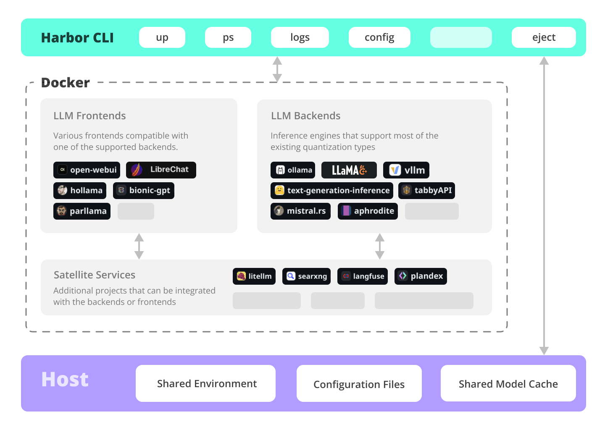

Welcome to the harbor wiki!

- [Installing Harbor](https://github.com/av/harbor/wiki/1.0.-Installing-Harbor) 
  Guides to install Harbor CLI and App
- [Harbor User Guide](https://github.com/av/harbor/wiki/1.-Harbor-User-Guide) 
  High-level overview of working with Harbor
- [Harbor App](https://github.com/av/harbor/wiki/1.1-Harbor-App) 
  Overview and manual for the Harbor companion application
- [Harbor Services](https://github.com/av/harbor/wiki/2.-Services) 
  Catalog of services available in Harbor
- [Harbor CLI Reference](https://github.com/av/harbor/wiki/3.-Harbor-CLI-Reference) 
  Read more about Harbor CLI commands and options.
  Read about supported services and the ways to configure them.
- [Compatibility](https://github.com/av/harbor/wiki/4.-Compatibility) 
  Known compatibility issues between the services and models as well as possible workarounds.
- [Harbor Bench](https://github.com/av/harbor/wiki/5.1.-Harbor-Bench) 
  Documentation for the built-in LLM benchmarking service.
- [Harbor Boost](https://github.com/av/harbor/wiki/5.2.-Harbor-Boost) 
  Documentation for the built-in LLM optimiser proxy.
- [Harbor Compose Setup](https://github.com/av/harbor/wiki/6.-Harbor-Compose-Setup) 
  Read about the way Harbor uses Docker Compose to manage services.
- [Adding A New Service](https://github.com/av/harbor/wiki/7.-Adding-A-New-Service) 
  Documentation on bringing more services into the Harbor toolkit.

Also see the main [README.md](https://github.com/av/harbor/blob/main/README.md) for some additional information.
