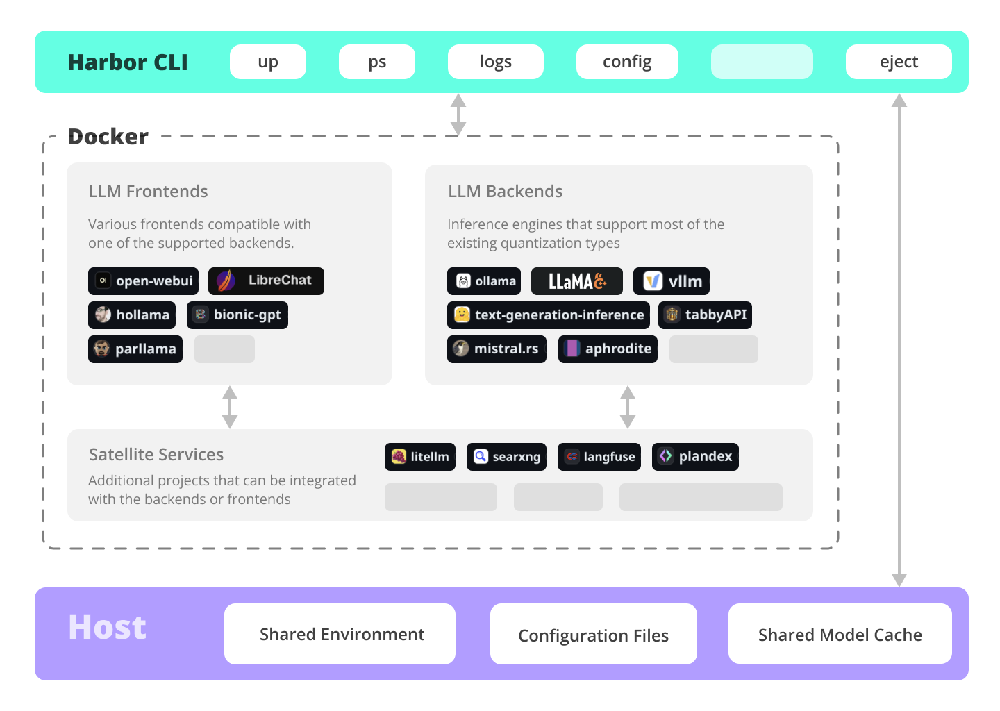

Welcome to the harbor wiki!

- [Installing Harbor](https://github.com/av/harbor/wiki/1.0.-Installing-Harbor) 
  Guides to install Harbor CLI and App, including the [agent install prompt](https://github.com/av/harbor/blob/main/install.md) for Claude Code, Codex, and similar tools
- [Harbor User Guide](https://github.com/av/harbor/wiki/1.-Harbor-User-Guide) 
  High-level overview of working with Harbor
- [Harbor Tools](https://github.com/av/harbor/wiki/1.2-Tools) 
  Overview of features and services related to tool use
- [Harbor App](https://github.com/av/harbor/wiki/1.1-Harbor-App) 
  Overview and manual for the Harbor companion application
- [Harbor Services](https://github.com/av/harbor/wiki/2.-Services) 
  Catalog of services available in Harbor
- [Harbor CLI Reference](https://github.com/av/harbor/wiki/3.-Harbor-CLI-Reference) 
  Read more about Harbor CLI commands and options.
  Read about supported services and the ways to configure them.
- [Compatibility](https://github.com/av/harbor/wiki/4.-Compatibility) 
  Known compatibility issues between the services and models as well as possible workarounds.
- [Harbor Bench](https://github.com/av/harbor/wiki/5.1.-Harbor-Bench) 
  Documentation for the built-in LLM benchmarking service.
- [Harbor Boost](https://github.com/av/harbor/wiki/5.2.-Harbor-Boost) 
  Documentation for the built-in LLM optimiser proxy.
- [Harbor Compose Setup](https://github.com/av/harbor/wiki/6.-Harbor-Compose-Setup) 
  Read about the way Harbor uses Docker Compose to manage services.
- [Adding A New Service](https://github.com/av/harbor/wiki/7.-Adding-A-New-Service) 
  Documentation on bringing more services into the Harbor toolkit.
- [Harbor Guides](https://github.com/av/harbor/wiki/8.-Guides) 
  Practical guides for local LLM stacks, Docker Compose orchestration, and common Harbor workflows.
  Start with [Local LLM Stack with Docker Compose](https://github.com/av/harbor/wiki/8.1-Local-LLM-Stack-with-Docker-Compose), [Ollama + Open WebUI + SearXNG Local Web RAG Setup](https://github.com/av/harbor/wiki/8.2-Ollama-Open-WebUI-SearXNG-Local-Web-RAG-Setup), or [Self-Hosted AI Stack for Developers](https://github.com/av/harbor/wiki/8.6-Self-Hosted-AI-Stack-for-Developers).
  Developer-focused guides cover [Run Coding Agents with Local LLMs](https://github.com/av/harbor/wiki/8.3-Run-Coding-Agents-with-Local-LLMs), [OpenAI-Compatible Local LLM Backends](https://github.com/av/harbor/wiki/8.5-OpenAI-Compatible-Local-LLM-Backends), [Harbor vs Manual Docker Compose for Local AI](https://github.com/av/harbor/wiki/8.4-Harbor-vs-Manual-Docker-Compose-for-Local-AI), [Run Hermes Agent with Harbor](https://github.com/av/harbor/wiki/8.7-Run-Hermes-Agent-with-Harbor), [Run MLX on Apple Silicon with Harbor](https://github.com/av/harbor/wiki/8.8-Run-MLX-on-Apple-Silicon-with-Harbor), and [Docker Model Runner with Harbor](https://github.com/av/harbor/wiki/8.9-Docker-Model-Runner-with-Harbor).

Also see the main [README.md](https://github.com/av/harbor/blob/main/README.md) for some additional information.
